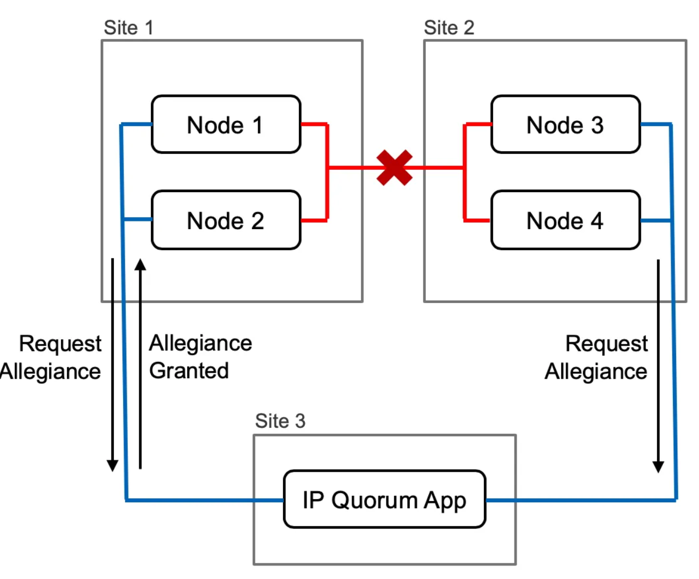

# Repo for the IBM Storage Virtualize — IP Quorum application Service

Repo to gather the different ways to run the IP Quorum app for IBM Storage Virtualize + tips and triks.

# Some information about the IP-Quorum application for Spectrum Virtualize.

-----

A quorum device is used to break a tie when a SAN fault occurs, when exactly half of the nodes that were previously a member of the cluster are present
The IP quorum application is a Java application that runs on a separate server or host. (This can be physical or Virtual Machine.)
An IP quorum application is used in IP networks to resolve failure scenarios where half the control canisters/nodes on the cluster become unavailable.
The application determines which nodes or enclosures can continue processing host operations and avoids a split cluster, where both halves of the system continue to process I/O independently.

IBM Storage Virtualize is Motor for IBM FlashSystem and IBM SVC

## Options for running IP Quorum Service. 

* [Guides for Running IP Quorum as a Systemd on linux](ipquorum-systemd/readme-ipquorum-systemd.md)

* [Guides for Running IP Quorum as a Container on linux](ipquorum-container/ibm-virtualize-ipquorum-container.md)

Tips and Triks
====

## Downloading the Java app from Storage Virtualize Box

### RestAPI - New from IBM Storage Virtualize Code 8.6.1

